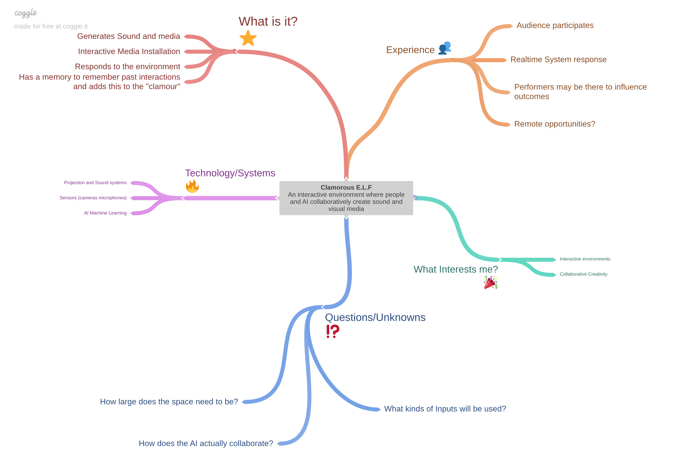

# Directed Brainstorming: Expanding the Possibility Space

## Purpose

Your current Culmination Project idea represents what you think the
project might become **right now**. Today, we will deliberately disrupt
and expand that idea.

You will begin by creating a mind map representing your current
thinking. You will then work with several classmates. During each
encounter, a collaborator will examine your evolving mind map, choose
something to explore, and use a randomly selected brainstorming method
to perturb that part of the project.

The immediate objective is **not to improve, evaluate, solve, or
finalize your project**. The objective is to expand its possibility
space. Evaluation and selection come later.

> **Capture everything. Follow what emerges. Commit to nothing.**

During the brainstorming rounds, every idea and every new question that
emerges goes onto your mind map.

Putting something on the map does not mean that you agree with it, like
it, think it is feasible, or intend to pursue it. It simply means that
the idea entered the project's possibility space.

**Nothing is deleted during brainstorming.**

------------------------------------------------------------------------

## Part 1 --- Build Your Initial Mind Map

Open [Coggle](https://coggle.it/) and create a new mind map.

Name it:

**MTEC 3501 --- \[Your Name\] --- Culmination Project Mind Map**

Place your current project idea at the center. A working title and short
description are sufficient.

Create branches representing what you currently think about the project.
Your map must include:

-   your current project idea at the center;
-   a **Questions / Unknowns** branch for questions that emerge during
      the activity.

Other useful starting branches include:

-   **What is it?**
-   **People / Experience**
-   **Technology / Media**
-   **What interests me?**
-   **Questions / Unknowns**

These are prompts rather than a required set of categories. You may use,
rename, combine, or replace the suggested branches. Add branches that are
more useful for your project, such as **Context**, **Audience**, **Rules**,
**Materials**, **Risks**, or **References**. Your map should represent the
way **you currently understand your project**.

Keep this first version relatively simple. Do not try to anticipate
every possible direction. The purpose of the initial map is to establish
a starting point that can be expanded through brainstorming.

### Record the Mind Map in Your Repository

Copy the shareable Coggle link and record it in your project repository.
Add it to your `README.md` or to another clearly named project document,
such as `project_links.md` or `project_log.md`.

Label the link clearly, for example:

```markdown
## Working Mind Map

[Coggle mind map](PASTE-YOUR-COGGLE-LINK-HERE)
```

Update the repository link if you create a new map or move the project to
a different Coggle document. Make sure the sharing permissions allow the
instructor and assigned collaborators to access the map.

### Example



Notice that the example is deliberately incomplete. It represents the
project's current state of thinking, not a finished project plan.

Before beginning the round robin, make sure you can explain your current
project idea to another person in approximately **one minute**.

### One Map per Student

Each student creates and maintains their own Coggle mind map. The map
travels with its project owner through the collaboration rounds; students
do not combine the class into one shared map.

The project owner remains responsible for capturing contributions on their
own map. Collaborators help generate ideas, but they should not reorganize
or delete the owner's existing branches.

### Practice Once on Your Own Map

After recording the initial map, practice the process once by yourself.
Draw one Brainstorming Card, choose one part of your own map that the card
can transform, and add the resulting ideas to the map. If a question or
unknown appears, record it in **Questions / Unknowns** as well as near the
branch where it arose.

### Preserve Your Starting Point

Before beginning the round robin, export or capture an image of your
initial mind map.

Keep this as your **Initial Mind Map**. You will continue modifying the
live Coggle map during the brainstorming session.

This gives you a record of:

**What I thought at the beginning → What emerged through brainstorming**

------------------------------------------------------------------------

# Part 2 --- Randomized Round-Robin Brainstorming

You will work with a series of different collaborators.

The goal is to encounter as many different classmates as the class size
and available time allow. With seven students, a complete round robin is
possible: each student can work with each of the other six students. This
requires seven rotation slots, with one student taking a bye in each slot.
The bye should rotate so that everyone has the same number of encounters.

For a larger class, do not assume that a complete round robin is practical.
Use a planned subset of pairings so that each student encounters several
different collaborators without making the activity consume the entire
class session.

For every encounter, the **project owner keeps their own Coggle mind map
open**.

The mind map itself is the prompt.

The incoming collaborator does not need to begin with a problem selected
by the project owner. Instead, they examine the current map and choose
something that seems interesting to explore.

This might be:

-   a major branch;
-   a small branch;
-   an experience;
-   a technology or medium;
-   an assumption;
-   an opportunity;
-   a contradiction;
-   a question or unknown;
-   a connection between ideas;
-   or something introduced by a previous collaborator.

As the exercise continues, later collaborators may therefore brainstorm
ideas that did not exist when the exercise began.

------------------------------------------------------------------------

## The Process

### 1. Present

The project owner briefly explains their project and current mind map.

Aim for approximately **one minute**. The purpose is to provide enough
context to begin exploring, not to defend or completely explain the
project.

### 2. Look

The brainstormer examines the project owner's current mind map.

Notice what is already there, what has grown, questions and uncertainties,
unusual or contradictory branches, and ideas contributed during previous
encounters.

### 3. Draw

The brainstormer randomly draws a **Brainstorming Card** before choosing
an area of the map. Alternatively, roll a 12-sided die; the number
corresponds to one of the twelve operations below.

Four physical decks are sufficient for the current class: place one deck
with each working group and return the card after the encounter. If a deck
is unavailable, use the d12 alternative.

If the card genuinely cannot be applied after a good-faith attempt, the
brainstormer may exchange it once. Do not exchange a card simply because
the method seems difficult, absurd, or inconvenient; incompatibility may
be productive.

### 4. Choose

The brainstormer chooses **something on the map to explore** using the
selected operation. There is no requirement to choose a problem or a
question. Any part of the project's current possibility space can become
the starting point.

### 5. Brainstorm

The brainstormer applies the selected operation to the chosen area. The
conversation can move beyond the original branch if new connections
emerge.

The project owner may answer questions and clarify the current idea, but
should **not evaluate, defend against, reject, or explain away the
possibilities being generated**.

The brainstormer is not trying to tell the project owner what the
project should become. The task is to **transform the possibility space**.

### 6. Capture Everything

The project owner records **everything that emerges** on their own mind
map.

Capture:

-   new ideas;
-   variations;
-   extensions;
-   contradictions;
-   misunderstandings;
-   impossible ideas;
-   connections;
-   failures;
-   opportunities;
-   and new questions.

If brainstorming creates another question or unknown, **always add it to
the Questions / Unknowns branch**. It may also remain near the branch
where it first emerged, but Questions / Unknowns is the shared record of
what the project does not yet know.

Questions / Unknowns may become one of the largest parts of the map.
That is not a problem. Discovering what you do not yet know is one of
the useful outcomes of speculation.

Place new material wherever it makes conceptual sense. It does not need
to remain attached to the branch where the conversation began.

**Recording an idea is not endorsing it.**

### 7. Switch

If time permits, reverse roles within the same encounter so that both
students contribute to one another's maps. Otherwise, the next rotation
begins with a new pairing and a new project owner.

The new project owner presents their map.

The new brainstormer:

**Looks → Draws → Chooses → Brainstorms**

while the project owner captures everything that emerges.

### 8. Rotate

Move to a new collaborator and repeat the process.

The map remains open and continues accumulating material.

### Asynchronous Continuation

The live class activity uses **three rotation slots** so students can
experience several different collaborators without spending the entire
session in pair rotation. After class, continue the activity
asynchronously through the Coggle maps.

Use a planned set of new pairings so that students encounter additional
classmates. For seven students, the asynchronous phase can complete the
remaining pairings from the full six-person rotation as time allows. For a
larger class, complete only the assigned subset of pairings.

The project owner keeps the map link recorded in their repository and
remains responsible for capturing contributions. Asynchronous
collaborators should add ideas without deleting or reorganizing existing
branches.

------------------------------------------------------------------------

# The Brainstorming Deck

  ---------------------------------------------------------------------------
                    d12 Card              Operation        Core Provocation
  --------------------- ----------------- ---------------- ------------------
                  **1** **YES, AND...**   Extend           Accept what is
                                                           already there and
                                                           add to it. **What
                                                           else follows from
                                                           this?**

                  **2** **WHAT IF...?**   Transform        Change an
                                                           assumption or
                                                           condition. **What
                                                           if something were
                                                           different?**

                  **3** **WHAT IF NOT?**  Subtract         Remove something
                                                           that appears
                                                           necessary. **What
                                                           happens without
                                                           it?**

                  **4** **INVERT IT**     Reverse          Reverse a
                                                           relationship,
                                                           behavior,
                                                           sequence, goal, or
                                                           interaction.
                                                           **What happens if
                                                           it works
                                                           backward?**

                  **5** **CHANGE          Reframe          Experience the
                        PERSPECTIVE**                      project from
                                                           another point of
                                                           view. **What does
                                                           someone---or
                                                           something---else
                                                           experience?**

                  **6** **EXTREME IT**    Exaggerate       Push one quality
                                                           toward an extreme,
                                                           then consider its
                                                           opposite. **What
                                                           does the extreme
                                                           reveal?**

                  **7** **FORCED          Combine          Introduce
                        JUXTAPOSITION**                    something
                                                           apparently
                                                           unrelated. **What
                                                           happens when these
                                                           things collide?**

                  **8** **CHANGE THE      Relocate         Put the project
                        CONTEXT**                          somewhere or
                                                           sometime it was
                                                           never intended to
                                                           exist. **What
                                                           changes?**

                  **9** **CHANGE THE      Reorient         Give the project
                        AUDIENCE**                         to a radically
                                                           different
                                                           participant or
                                                           audience. **What
                                                           changes for
                                                           them?**

                 **10** **BREAK IT**      Disrupt          Make the project
                                                           fail, malfunction,
                                                           misunderstand, or
                                                           behave
                                                           unexpectedly.
                                                           **What does the
                                                           failure create?**

                 **11** **REMOVE THE      Decouple         Remove an assumed
                        TECHNOLOGY**                       technology. **What
                                                           remains of the
                                                           underlying idea?**

                 **12** **SWAP THE        Translate        Move the concept
                        MEDIUM**                           into a different
                                                           medium or form.
                                                           **What survives
                                                           the translation?
                                                           What changes?**
  ---------------------------------------------------------------------------

------------------------------------------------------------------------

# Random Words for Forced Juxtaposition

When **FORCED JUXTAPOSITION** is drawn, generate one unrelated word
before choosing the map area. Use the [Random Word Generator](https://randomwordgenerator.com/)
or an instructor-provided word list and random number method.

Use the first usable word generated. Do not keep generating words until
one seems to fit the project. The tension between the word and the map is
the point of the exercise. If the online generator is unavailable, the
instructor can provide a word or roll a die to select a word from a
prepared list.

# Using the Cards

The card identifies a **way of thinking**, not a particular answer.

For example, drawing **WHAT IF NOT?** does not automatically mean
"remove the screen." Look at the selected part of this particular
project and identify something it appears to depend upon. Explore what
happens when that thing disappears.

Similarly, **FORCED JUXTAPOSITION** should introduce something that does
not obviously belong. The goal is not to find an immediately sensible
combination. The tension between unrelated things is part of the
exercise.

An idea generated during one encounter can become the starting point for
another.

For example:

**WHAT IF NOT?**\
→ What if the installation has no screen?

A later collaborator notices this branch and draws:

**EXTREME IT**\
→ What if it has no visible interface at all?

That produces a new question:

→ How would someone know the environment was responding to them?

Another collaborator could later choose **that question** and draw:

**CHANGE PERSPECTIVE**\
→ How would the environment know whether the participant understood its
response?

The map therefore develops recursively:

**An idea creates another idea → which creates a question → which
creates another possibility.**

------------------------------------------------------------------------

# Rules of Divergence

During the round robin:

> **Transform the idea; don't judge it.**

You may:

-   extend;
-   subtract;
-   invert;
-   exaggerate;
-   combine;
-   relocate;
-   translate;
-   question;
-   contradict;
-   break;
-   misunderstand;
-   change perspective;
-   create new questions.

You may not yet decide whether an idea is good or bad.

Your map may become messy.

It may contain incompatible possibilities.

It may contain ideas that appear impossible.

It may contain more questions at the end than it contained at the
beginning.

**That is expected.**

The expanded map is **not your project proposal**. It is a record of the
possibility space surrounding your project.

------------------------------------------------------------------------

# Part 3 --- Stop and Observe

After the final round, stop generating new material.

**Do not clean up or delete anything yet.**

Compare your expanded map with the snapshot you made before
brainstorming began.

For now, do not select the "best" ideas.

Instead, look at what happened.

Consider:

-   What appeared that you did not expect?
-   What parts of the map expanded?
-   What concepts appeared repeatedly?
-   Where did contradictions emerge?
-   What connections appeared between previously separate ideas?
-   What assumptions were challenged?
-   What new questions appeared?
-   Did one collaborator build upon something generated by another?

At this point, we are beginning to change modes:

**Brainstorming:** What could be here?

**Synthesis:** What do I notice?

**Research:** What do I need to find out?

**Design:** What am I eventually going to do?

Do not collapse these stages prematurely.

The purpose of today's brainstorming is not to leave with a final
project.

It is to leave with a **larger, stranger, more complicated, and
potentially more interesting possibility space than the one you entered
with**.
